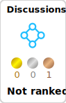

<!--
**TakekiMukaida/TakekiMukaida** is a ✨ _special_ ✨ repository because its `README.md` (this file) appears on your GitHub profile.

Here are some ideas to get you started:

- 🔭 I’m currently working on ...
- 🌱 I’m currently learning ...<!--

-->

<!--

-->

# Hello!  I'm Takeki Mukaida.
 

## Kaggle Results
   
